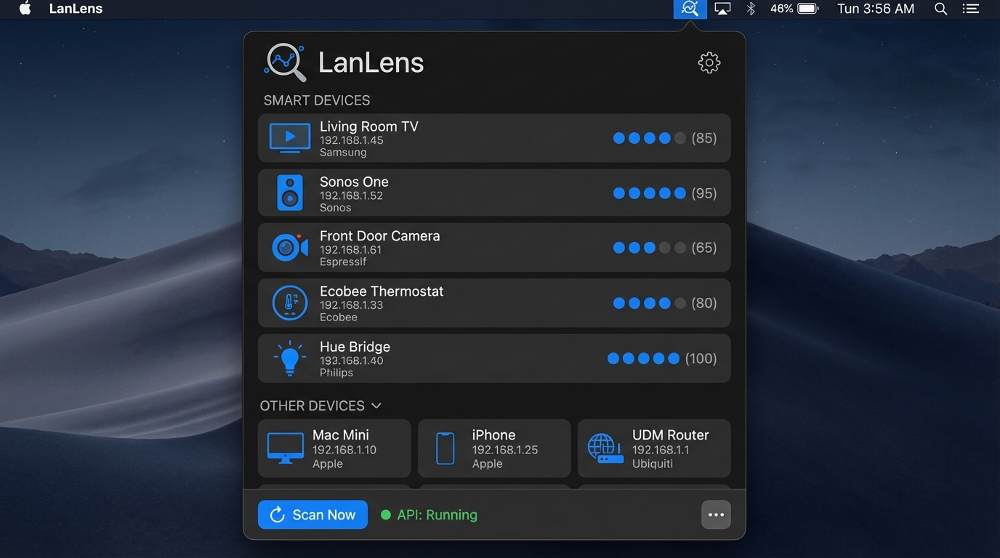
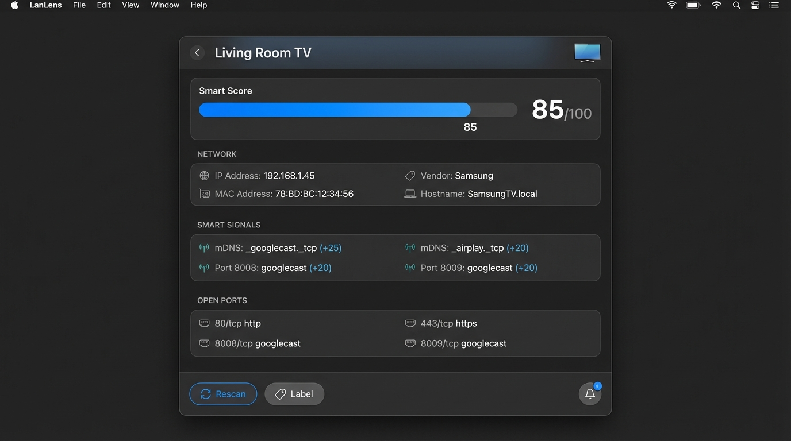
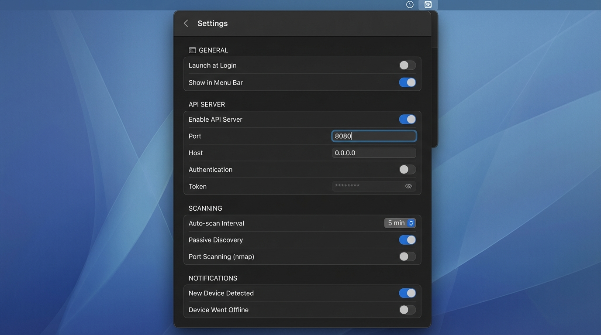

# Lan Lens

A macOS menu bar application for discovering, identifying, and analyzing devices on your local network with deep security and behavior insights.


## Features

### Core Discovery
- **Network Discovery** - Automatically discovers devices using ARP, mDNS, SSDP, and DNS-SD protocols
- **Device Fingerprinting** - Identifies device types, manufacturers, and models via UPnP and Fingerbank
- **Port Scanning** - Detects open ports and running services with Deep Scan
- **Smart Classification** - Categorizes devices as smart TVs, speakers, cameras, thermostats, etc.

### Enhanced Analysis
- **Security Assessment** - Risk scoring with actionable security recommendations
- **Behavior Tracking** - Learn device patterns (always-on infrastructure vs. mobile devices)
- **Protocol Detection** - AirPlay, Google Cast, HomeKit, and RAOP capability detection
- **Banner Grabbing** - SSH, HTTP, and RTSP service identification
- **MAC Analysis** - Vendor confidence, device age estimation, and VM/randomization detection

### User Interface
- **Menu Bar Interface** - Quick access with a clean, native macOS design
- **Network Summary** - At-a-glance view of device count, smart devices, and security issues
- **Risk Indicators** - Color-coded borders highlight devices needing attention
- **Interactive Tooltips** - Hover over badges for detailed information
- **REST API** - Optional local API server for integration with other tools

## Screenshots

| Main View | Device Detail | Settings |
|-----------|---------------|----------|
|  |  |  |

## Installation

### Requirements

- macOS 14.0 (Sonoma) or later
- Xcode 15+ (for building from source)

### Building from Source

1. Clone the repository:
   ```bash
   git clone https://github.com/eovidiu/LanLens.git
   cd LanLens
   ```

2. Build the Swift package:
   ```bash
   swift build
   ```

3. Build and run the macOS app:
   ```bash
   cd LanLensApp
   open LanLensApp.xcodeproj
   ```
   Then build and run in Xcode (⌘R).

## Usage

### Basic Scanning

1. Click the Lan Lens icon in your menu bar
2. The **Network Summary** header shows your device count, smart devices, and security issues
3. Devices with security concerns show colored left borders (orange = medium, red = high/critical)
4. Hover over badges for quick tooltips
5. Click any device to see detailed information including:
   - Security posture assessment
   - Behavior classification
   - Protocol capabilities (AirPlay, Cast, HomeKit)
   - MAC address analysis
   - Open ports and service banners

### Device Fingerprinting

Lan Lens uses two levels of device identification:

| Level | Method | Requirements |
|-------|--------|--------------|
| 1 | UPnP Device Description | None (automatic) |
| 2 | Fingerbank API | Free API key from [fingerbank.org](https://fingerbank.org) |

To enable Level 2 fingerprinting:
1. Get a free API key from [fingerbank.org](https://fingerbank.org)
2. Open Settings in Lan Lens
3. Enable Fingerbank and enter your API key

### Smart Device Detection

Lan Lens uses a **weighted confidence scoring system** to classify devices by aggregating signals from multiple discovery sources:

| Source | Weight | Description |
|--------|--------|-------------|
| **Fingerbank** | 0.9 | MAC address lookup database - most reliable |
| **UPnP** | 0.8 | Device description XML from UPnP responses |
| **mDNS** | 0.7 | Bonjour service types (e.g., `_airplay._tcp`) |
| **SSDP** | 0.7 | SSDP headers (SERVER, USN, ST) |
| **Hostname** | 0.6 | Device hostname patterns |
| **Port** | 0.5 | Open port numbers - least reliable |

**Detection Examples:**

| Signal | Detected Type | Confidence |
|--------|---------------|------------|
| mDNS `_sonos._tcp` | Speaker | 90% |
| mDNS `_airplay._tcp` | Smart TV | 80% |
| mDNS `_hue._tcp` | Light | 95% |
| SSDP Server "Roku" | Smart TV | 95% |
| Port 1400 open | Speaker (Sonos) | 85% |
| Port 8008/8009 open | Smart TV (Cast) | 80% |
| Hostname contains "iphone" | Phone | 85% |

The scoring algorithm:
1. Each signal suggests a device type with a confidence score (0.0-1.0)
2. Confidence is multiplied by the source weight
3. Scores are summed per device type
4. The type with the highest total score wins

### Deep Scan

For detailed device analysis, use the **Deep Scan** feature:

1. Click on any device in the list to open its detail view
2. Click the **Deep Scan** button at the bottom
3. Lan Lens will probe the device for:
   - Open ports (SSH, HTTP, HTTPS, RTSP, and smart device ports)
   - Service banners (software versions, server types)
   - Security vulnerabilities (risky ports, missing encryption)

**What Deep Scan reveals:**
- Exact software versions (e.g., "OpenSSH 9.0" or "Apache 2.4.52")
- Camera/NAS/router web interfaces
- Outdated firmware indicators
- Security risk factors with remediation suggestions

### Security Assessment

Lan Lens automatically assesses the security posture of each device:

| Risk Level | Indicator | Meaning |
|------------|-----------|---------|
| **Critical** | Red border + tinted background | Immediate action needed (e.g., Telnet open, default credentials likely) |
| **High** | Red border | Significant vulnerabilities (e.g., unencrypted admin interfaces) |
| **Medium** | Orange border | Moderate concerns (e.g., UPnP enabled, SMB exposed) |
| **Low** | No border | Generally secure |

**To view security details:**
1. Look for colored left borders on device rows
2. Hover over the security badge for a quick summary
3. Click the device to see the full **Security Posture** card with:
   - Risk score (0-100)
   - Individual risk factors with severity
   - Risky ports highlighted
   - Specific recommendations

### Behavior Analysis

Lan Lens tracks device presence patterns over time to classify behavior:

| Classification | Uptime | Examples |
|----------------|--------|----------|
| **Infrastructure** | 95%+ | Routers, access points, NAS |
| **Server** | 85-95% | Home servers, always-on media |
| **IoT** | High, limited services | Smart home devices |
| **Workstation** | 50-85%, daily pattern | Desktop computers |
| **Portable** | 20-50% | Laptops |
| **Mobile** | 5-20% | Phones, tablets |
| **Guest** | <5% | Visitors' devices |

**To benefit from behavior tracking:**
- Keep Lan Lens running to accumulate presence data
- After ~10 observations, devices receive behavior classifications
- Look for the behavior badge (icon overlay) on device rows
- Hover for uptime percentage and classification
- Click to see the full **Behavior Profile** card with peak hours and patterns

### Protocol Detection (mDNS TXT Records)

Lan Lens parses mDNS TXT records to detect smart home capabilities:

| Protocol | What's Detected |
|----------|-----------------|
| **AirPlay** | Model, features (screen mirroring, audio), AirPlay 2 support |
| **Google Cast** | Device name, firmware version, group support |
| **HomeKit** | Category (light, thermostat, camera), pairing status |
| **RAOP** | Audio formats, lossless support, compression types |

This information appears in the **mDNS TXT Records** card in device details.

### MAC Address Analysis

Every device's MAC address is analyzed for:

- **Vendor identification** with confidence level (High/Medium/Low)
- **OUI age estimation** (Legacy, Established, Modern, Recent)
- **Randomization detection** - Identifies privacy-preserving random MACs
- **VM detection** - Flags virtual machine MAC addresses

Look for the **MAC Analysis** card in device details, especially useful for:
- Identifying unknown devices by manufacturer
- Spotting guest devices using randomized MACs
- Detecting virtual machines on your network

### REST API

Lan Lens includes an optional REST API server for integration:

1. Open Settings
2. Enable "API Server"
3. Configure port and authentication
4. Access the API at `http://localhost:8080/api/devices`

## Project Structure

```
LanLens/
├── Sources/LanLensCore/
│   ├── Discovery/               # Network discovery (ARP, mDNS, SSDP, DNS-SD)
│   ├── Analysis/                # Enhanced analysis engines
│   │   ├── SecurityPostureAssessor.swift
│   │   ├── DeviceBehaviorTracker.swift
│   │   ├── MDNSTXTRecordAnalyzer.swift
│   │   ├── PortBannerGrabber.swift
│   │   └── MACAddressAnalyzer.swift
│   ├── Fingerprinting/          # Device identification (UPnP, Fingerbank)
│   ├── Models/                  # Data models
│   ├── API/                     # REST API server
│   └── Logging/                 # Unified logging
├── LanLensApp/                  # Xcode project for macOS app
│   └── LanLensApp/
│       ├── Views/
│       │   ├── MenuBarView.swift
│       │   ├── DeviceDetailView.swift
│       │   ├── DeviceRowView.swift
│       │   └── Components/      # Reusable UI components
│       │       ├── SecurityBadge.swift
│       │       ├── SecurityPostureCard.swift
│       │       ├── BehaviorBadge.swift
│       │       ├── BehaviorProfileCard.swift
│       │       ├── MDNSTXTCard.swift
│       │       ├── MACAnalysisCard.swift
│       │       ├── PortBannerCard.swift
│       │       └── TooltipModifier.swift
│       ├── State/               # App state management (@Observable)
│       └── Design/              # Colors, styling
├── Tests/                       # Unit tests
└── docs/
    ├── inference-capabilities.md  # Complete inference system reference
    └── data-models.md             # Data structure documentation
```

## Planned Features

The following enhancements are planned for future releases:

| Feature | Description | Status |
|---------|-------------|--------|
| **Offline Fingerbank Cache** | Bundled fingerprint database for device identification without internet | Planned |
| **DHCP Fingerprinting** | Passive DHCP Option 55 capture for improved device identification | Planned |
| **TLS Fingerprinting** | JA3/JA4 fingerprints for device and application classification | Planned |
| **iOS Companion App** | Remote access to LanLens data via REST API | Planned |

See [docs/specs/fingerprint-enhancements.md](docs/specs/fingerprint-enhancements.md) for detailed specifications.

## Privacy

- **Local-only by default**: All scanning happens on your local network
- **No data collection**: Lan Lens doesn't send any data to external servers (except Fingerbank if enabled)
- **Fingerbank is opt-in**: MAC addresses are only sent to Fingerbank if you explicitly enable it and provide an API key
- **Behavior data stays local**: Device presence history is stored locally in `~/Library/Application Support/LanLens/`

## Contributing

Contributions are welcome! Please feel free to submit a Pull Request.

## License

This project is licensed under the MIT License - see the [LICENSE](LICENSE) file for details.

## Acknowledgments

- [Fingerbank](https://fingerbank.org) for device fingerprinting database
- [Hummingbird](https://github.com/hummingbird-project/hummingbird) for the Swift HTTP server
- [SQLite.swift](https://github.com/stephencelis/SQLite.swift) for database support
